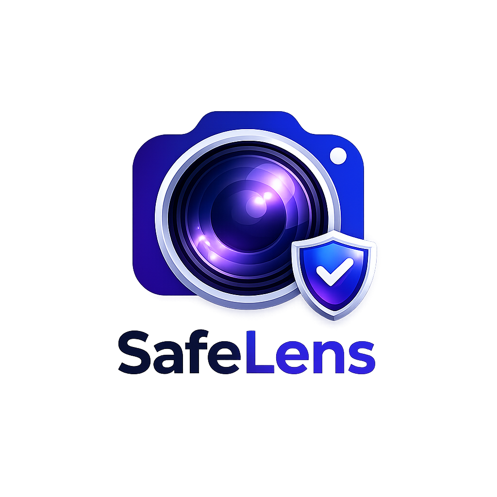

# APP-DEVELOPMENT-2
My App Development 2 project is about Safe Lens, a feature that safeguards social media users when they share content over social media. It is demonstrated in the form of a website
# STARTED OFF MY WEBSITE WITH HTML, ADDING ALL THE CONTENT, & NAV LINKS THE WEBSITE WILL REQUIRE
# INDEX
<!DOCTYPE html>
<html lang="en">
<head>
    <meta charset="UTF-8">
    <meta http-equiv="X-UA-Compatible" content="IE=edge">
    <meta name="viewport" content="width=device-width, initial-scale=1.0">
    <link rel="icon" type="image/png" href="safe-lens-logo.png">
    <title>Safe Lens - Your Digital Security Guard</title>

    <!-- Google Fonts: Poppins for headings, Roboto for body text -->
    <link rel="preconnect" href="https://fonts.googleapis.com">
    <link rel="preconnect" href="https://fonts.gstatic.com" crossorigin>
    <link href="https://fonts.googleapis.com/css2?family=Poppins:wght@500;600;700;800&family=Roboto:wght@400;500&display=swap" rel="stylesheet">

    <!-- Our stylesheet -->
    <link rel="stylesheet" type="text/css" href="index.css" />
</head>
<body>

    <header class="safe-lens-header">
        

            <a href="index.html" class="logo">
                
                SafeLens
            </a>

            <!-- Hamburger button: only visible on small screens, controlled by index.js -->
            <button class="nav-toggle" id="navToggle" aria-label="Open menu" aria-expanded="false">
                
                
                
            </button>

            <nav class="navigation" id="primaryNav">
                <ul>
                    <li><a href="index.html">HOME</a></li>
                    <li><a href="How it Works.html">HOW IT WORKS</a></li>
                    <li><a href="demo.html">DEMO</a></li>
                    <li><a href="faq.html">FAQ</a></li>
                </ul>
            </nav>
        

    </header>

    <main>
        <section class="hero">
            <!-- This empty div gets filled with floating emoji by index.js -->
            

            <h1 class="hero-title">Safe Lens  Your Social Media Digital Security Guard!</h1>

            

                

                    Social media has become a phenomenon that makes it less difficult to "love
                    thy neighbour" or to "keep your enemies closer," because these individuals are now right in the
                    palm of our hands.
                

                

                    It is safe to say that the many social media platforms we are exposed to
                    were created with good intention, but the use of them has become malicious especially when
                    it comes to what we share online. This is where Safe Lens comes in.
                

            

        </section>
    </main>

    <!-- Our JavaScript file, loaded at the end so the page content exists first -->
    
</body>
</html>

# how-it-works
<!DOCTYPE html>
<html lang="en">
<head>
    <meta charset="UTF-8">
    <meta http-equiv="X-UA-Compatible" content="IE=edge">
    <meta name="viewport" content="width=device-width, initial-scale=1.0">
    <link rel="icon" type="image/png" href="safe-lens-logo.png">
    <title>Safe Lens - How it works</title>

    <!-- Google Fonts: Poppins for headings, Roboto for body text -->
    <link rel="preconnect" href="https://fonts.googleapis.com">
    <link rel="preconnect" href="https://fonts.gstatic.com" crossorigin>
    <link href="https://fonts.googleapis.com/css2?family=Poppins:wght@500;600;700;800&family=Roboto:wght@400;500&display=swap" rel="stylesheet">

    <!-- Our stylesheet -->
    <link rel="stylesheet" type="text/css" href="how-it-works.css" />
</head>
<body>

    <header class="safe-lens-header">
        

            <a href="index.html" class="logo">
                
                SafeLens
            </a>

            <!-- Hamburger button: only visible on small screens, controlled by index.js -->
            <button class="nav-toggle" id="navToggle" aria-label="Open menu" aria-expanded="false">
                
                
                
            </button>

            <nav class="navigation" id="primaryNav">
                <ul>
                    <li><a href="index.html">HOME</a></li>
                    <li><a href="How it Works.html">HOW IT WORKS</a></li>
                    <li><a href="demo.html">DEMO</a></li>
                    <li><a href="faq.html">FAQ</a></li>
                </ul>
            </nav>
        

    </header>

    <main>
        <section class="hero">
            <!-- This empty div gets filled with floating emoji by how-it-works.js -->
            

            <h1 class="hero-title">Safe Lens -  Think Before You Share</h1>

            

                

                    Social Media users put little to no thought into what they share online. Safe Lense is there to guide users
                    into a "think before you share" habit. 
                

                

                     Safe Lense is a camera feature that will ideally be integrated into all social media platform cameras and the 
                     default camera of all cellphone devices.  
                

                

                    Before the selected content is shared on the desired platform is sent or 
                    posted on the desired social media platform, the following alert will appear:  
                    "The selected content appears to be sensitive/explicit.   Think before you share.
                    Sharing content of this nature can affect your privacy, safety and future.
                    if someone else is included in this content, make sure you have their consent before Sharing.  
                    <b>Are you sure you want to share?"</b>
                     
                    They will have the option to go back or continue.
                    Depending on the user's choice, the social media platform will return to its landing page
                    or their open chats if they select "Go back" or it will proceed to share if they select "Yes, continue".
                    This way, no matter what the user decides to do after, they will be making an informed decision.
                

            

        </section>
    </main>

    <!-- Our JavaScript file, loaded at the end so the page content exists first -->
    
</body>
</html>

#Demo
<!DOCTYPE html>
<html lang="en">
<head>
    <meta charset="UTF-8">
    <meta http-equiv="X-UA-Compatible" content="IE=edge">
    <meta name="viewport" content="width=device-width, initial-scale=1.0">
    <link rel="icon" type="image/png" href="safe-lens-logo.png">
    <title>Safe Lens - Your Digital Security Guard</title>

    <!-- Google Fonts: Poppins for headings, Roboto for body text -->
    <link rel="preconnect" href="https://fonts.googleapis.com">
    <link rel="preconnect" href="https://fonts.gstatic.com" crossorigin>
    <link href="https://fonts.googleapis.com/css2?family=Poppins:wght@500;600;700;800&family=Roboto:wght@400;500&display=swap" rel="stylesheet">

    <!-- Our stylesheet -->
    <link rel="stylesheet" type="text/css" href="Demo.css" />
</head>
<body>

    <header class="safe-lens-header">
        

            <a href="index.html" class="logo">
                
                SafeLens
            </a>

            <!-- Hamburger button: only visible on small screens, controlled by Demo.js -->
            <button class="nav-toggle" id="navToggle" aria-label="Open menu" aria-expanded="false">
                
                
                
            </button>

            <nav class="navigation" id="primaryNav">
                <ul>
                    <li><a href="index.html">HOME</a></li>
                    <li><a href="How it Works.html">HOW IT WORKS</a></li>
                    <li><a href="demo.html">DEMO</a></li>
                    <li><a href="faq.html">FAQ</a></li>
                </ul>
            </nav>
        

    </header>

    

    

    
  

  

    
  

    <main>
        <section class="hero">
            <!-- This empty div gets filled with floating emoji by index.js -->
            

            <h1 class="hero-title">Safe Lens  In-Real-Life Demo</h1>
            

                These images demostrate the feature in live action for Instagram and for Whatsapp.
            

    <!-- Our JavaScript file, loaded at the end so the page content exists first -->
    

    #faq
    <!DOCTYPE html>
<html lang="en">
<head>
    <meta charset="UTF-8">
    <meta http-equiv="X-UA-Compatible" content="IE=edge">
    <meta name="viewport" content="width=device-width, initial-scale=1.0">
    <link rel="icon" type="image/png" href="safe-lens-logo.png">
    <title>Safe Lens - FAQ</title>

    <!-- Google Fonts: Poppins for headings, Roboto for body text -->
    <link rel="preconnect" href="https://fonts.googleapis.com">
    <link rel="preconnect" href="https://fonts.gstatic.com" crossorigin>
    <link href="https://fonts.googleapis.com/css2?family=Poppins:wght@500;600;700;800&family=Roboto:wght@400;500&display=swap" rel="stylesheet">

    <!-- Our stylesheet -->
    <link rel="stylesheet" type="text/css" href="faq.css" />
</head>
<body>

    <header class="safe-lens-header">
        

            <a href="faq.html" class="logo">
                
                SafeLens
            </a>

            <!-- Hamburger button: only visible on small screens, controlled by faq.js -->
            <button class="nav-toggle" id="navToggle" aria-label="Open menu" aria-expanded="false">
                
                
                
            </button>

            <nav class="navigation" id="primaryNav">
                <ul>
                    <li><a href="index.html">HOME</a></li>
                    <li><a href="How it Works.html">HOW IT WORKS</a></li>
                    <li><a href="demo.html">DEMO</a></li>
                    <li><a href="faq.html">FAQ</a></li>
                </ul>
            </nav>
        

    </header>

    <main>
        <section class="hero">
            <!-- This empty div gets filled with floating emoji by index.js -->
            

            <h1 class="hero-title">Safe Lense -  FAQ</h1>

            <b>
                How does Safe Lense Detect Inappropriate Content?
            </b>
            

                Safe Lens detects inappropriate content through Artificial Intelligance. It will compare
                content to the examples it has been taught, tailor made for the feature. The alert will
                then be triggered if it detects as taught.
            

     
    <b>
        Does Safe Lense automatically delete my pictures?
    </b>
    

        No.  Safe Lense does not delete your pictures, it will only detect their explicity before you
        choose to share it on social media or not. You will stil be able to access them in your gallery.
    

     
    <b>
        Can I turn Safe Lense off?
    </b>
    

        You cannot turn Safe Lense off.  You can respond to the alert message by either going back or continuing 
        to share.
    

     
    <b>
        Does Safe Lense replace parental controls?
    </b>
    

        Safe Lense does not replace parental controls but supports it on the go.  It has the same functionallity that
        parental guidance apps like Bark has. Should children choose to continue, the parent will be notified of the risk
        that arises.
    

     
    <b>
        What is the future of Safe Lense?
    </b>
    

        At the moment, Safe lense is only detecting the explicity of images. In the near future, we plan to integrate in for 
        video detection as well, because believe it or not, people still take fottage of what sould remain private.
    

            

        </section>
    </main>

    <!-- Our JavaScript file, loaded at the end so the page content exists first -->
    
</body>
</html>

#CSS FOR THE LOOK OF MY WEBSITE IN EACH WEB PAGE
#INDEX

:root {
    /* Brand palette (from the Safe Lens style guide) */
    --dark-navy:  #281940; /* main background / dark text */
    --cyan:       #16e9e4; /* bright accent */
    --magenta:    #cb3cc9; /* accent */
    --purple:     #a633ce; /* accent */
    --indigo:     #6350c7; /* accent */
    --mint:       #3fe7b5; /* accent */
    --deep-green: #09966c; /* accent (used sparingly, it's darker) */
    --gold:       #f2c150; /* accent, great for small highlights */
    --peach:      #f1ccb6; /* soft warm neutral */
    --white:      #ffffff;

    /* Fonts */
    --font-heading: 'Poppins', sans-serif;
    --font-body: 'Roboto', sans-serif;

    /* Reused values so spacing stays consistent across the page */
    --max-width: 1100px;
    --radius: 16px;
    --transition: 0.25s ease;
}

* {
    box-sizing: border-box;
    margin: 0;
    padding: 0;
}

html {
    scroll-behavior: smooth; /* smooth scrolling when jumping to #anchors */
}

body {
    font-family: var(--font-body);
    background-color: var(--dark-navy);
    color: var(--white);
    line-height: 1.7;
    /* A soft glow behind the whole page using two radial gradients.
       Think of these like two spotlights of colour, faded out. */
    background-image:
        radial-gradient(circle at 15% 0%, rgba(99, 80, 199, 0.35), transparent 45%),
        radial-gradient(circle at 100% 20%, rgba(22, 233, 228, 0.15), transparent 40%);
    background-attachment: fixed;
    overflow-x: hidden; /* stops the floating emoji from causing a sideways scrollbar */
}

h1, h2, h3 {
    font-family: var(--font-heading);
    font-weight: 700;
}

a {
    text-decoration: none;
    color: inherit;
}

ul {
    list-style: none;
}

img {
    max-width: 100%;
    display: block;
}

.safe-lens-header {
    position: sticky;
    top: 0;
    z-index: 100;
    background-color: rgba(40, 25, 64, 0.75); /* --dark-navy with transparency */
    backdrop-filter: blur(10px);
    -webkit-backdrop-filter: blur(10px);
    border-bottom: 1px solid rgba(255, 255, 255, 0.08);
    transition: box-shadow var(--transition);
}

/* index.js adds this class once the page has been scrolled a bit,
   so the header only shows a shadow once it "earns" it. */
.safe-lens-header.scrolled {
    box-shadow: 0 8px 24px rgba(0, 0, 0, 0.35);
}

.logo-container {
    max-width: var(--max-width);
    margin: 0 auto;
    padding: 14px 24px;
    display: flex;
    align-items: center;
    justify-content: space-between;
    gap: 16px;
}

.logo {
    display: flex;
    align-items: center;
    gap: 10px;
}

.logo-text {
    font-family: var(--font-heading);
    font-weight: 700;
    font-size: 1.3rem;
    color: var(--white);
}

.logo-accent {
    /* Gives just the word "Lens" a gradient fill instead of a flat colour */
    background: linear-gradient(90deg, var(--cyan), var(--magenta));
    -webkit-background-clip: text;
    background-clip: text;
    color: transparent;
}

.navigation ul {
    display: flex;
    gap: 28px;
}

.navigation a {
    font-family: var(--font-heading);
    font-size: 0.85rem;
    font-weight: 600;
    letter-spacing: 0.05em;
    color: var(--white);
    position: relative;
    padding: 6px 2px;
}

/* This creates a little underline that grows from the left on
   hover, using a pseudo-element (::after) instead of an extra
   HTML tag. scaleX(0) means "zero width", and on hover we grow
   it to scaleX(1) with a smooth transition. */
.navigation a::after {
    content: "";
    position: absolute;
    left: 0;
    bottom: -4px;
    width: 100%;
    height: 2px;
    background: linear-gradient(90deg, var(--cyan), var(--mint));
    transform: scaleX(0);
    transform-origin: left;
    transition: transform var(--transition);
}

.navigation a:hover::after,
.navigation a:focus::after {
    transform: scaleX(1);
}

/* The hamburger button is hidden by default (desktop view) and
   only appears on small screens — see the media query near the
   bottom of this file. */
.nav-toggle {
    display: none;
    flex-direction: column;
    justify-content: space-between;
    width: 26px;
    height: 18px;
    background: none;
    border: none;
    cursor: pointer;
}

.nav-toggle span {
    display: block;
    height: 2px;
    width: 100%;
    background-color: var(--white);
    border-radius: 2px;
    transition: transform var(--transition), opacity var(--transition);
}

/* index.js toggles this class when the hamburger is clicked,
   turning the three bars into an "X" shape. */
.nav-toggle.active span:nth-child(1) {
    transform: translateY(8px) rotate(45deg);
}
.nav-toggle.active span:nth-child(2) {
    opacity: 0;
}
.nav-toggle.active span:nth-child(3) {
    transform: translateY(-8px) rotate(-45deg);
}

.hero {
    position: relative; /* so the floating emoji can be positioned inside it */
    max-width: var(--max-width);
    margin: 0 auto;
    padding: 90px 24px 70px;
    text-align: center;
    overflow: hidden;
}

.hero-title {
    font-size: clamp(2.2rem, 5vw, 3.6rem); /* scales smoothly between screen sizes */
    line-height: 1.25;
    margin-bottom: 40px;
    /* The camera-lens gradient from the logo, applied to the text itself */
    background: linear-gradient(100deg, var(--cyan) 0%, var(--indigo) 45%, var(--magenta) 100%);
    -webkit-background-clip: text;
    background-clip: text;
    color: transparent;
    animation: fadeInUp 0.9s ease both;
}

/* A soft glowing "lens" shape sitting behind the title, drawn
   entirely in CSS (no image needed) using layered radial
   gradients + blur, echoing the camera lens in the logo. */
.hero::before {
    content: "";
    position: absolute;
    top: -120px;
    left: 50%;
    width: 420px;
    height: 420px;
    transform: translateX(-50%);
    background: radial-gradient(circle, var(--indigo) 0%, var(--purple) 40%, transparent 70%);
    filter: blur(60px);
    opacity: 0.45;
    z-index: -1;
    animation: pulse 6s ease-in-out infinite;
}

.intro {
    max-width: 720px;
    margin: 0 auto;
    display: flex;
    flex-direction: column;
    gap: 22px;
}

.intro p {
    background: rgba(255, 255, 255, 0.05);
    border: 1px solid rgba(255, 255, 255, 0.08);
    border-radius: var(--radius);
    padding: 22px 26px;
    font-size: 1.02rem;
    color: var(--peach);
    text-align: left;
}

.intro p b {
    color: var(--gold);
    font-size: 1.4em;
    font-family: var(--font-heading);
}

/* Paragraphs start invisible + shifted down. index.js adds the
   "visible" class once they scroll into view, which triggers
   the transition below — a simple, classic "reveal on scroll". */
.reveal {
    opacity: 0;
    transform: translateY(24px);
    transition: opacity 0.7s ease, transform 0.7s ease;
}

.reveal.visible {
    opacity: 1;
    transform: translateY(0);
}

.floaters {
    position: absolute;
    inset: 0; /* shorthand for top/right/bottom/left: 0 */
    pointer-events: none; /* lets clicks pass through to content underneath */
}

.floater {
    position: absolute;
    font-size: 1.6rem;
    opacity: 0.85;
    animation: floatUp linear infinite;
}

@keyframes fadeInUp {
    from {
        opacity: 0;
        transform: translateY(20px);
    }
    to {
        opacity: 1;
        transform: translateY(0);
    }
}

@keyframes pulse {
    0%, 100% { opacity: 0.35; transform: translateX(-50%) scale(1); }
    50%      { opacity: 0.55; transform: translateX(-50%) scale(1.08); }
}

@keyframes floatUp {
    0%   { transform: translateY(0) rotate(0deg); }
    50%  { transform: translateY(-18px) rotate(8deg); }
    100% { transform: translateY(0) rotate(0deg); }
}

@media (max-width: 700px) {
    .nav-toggle {
        display: flex; /* show the hamburger */
    }

    .navigation {
        position: absolute;
        top: 100%;
        left: 0;
        width: 100%;
        background-color: var(--dark-navy);
        border-bottom: 1px solid rgba(255, 255, 255, 0.08);
        max-height: 0;
        overflow: hidden;
        transition: max-height var(--transition);
    }
    

    /* index.js adds "nav-open" to the nav when the hamburger is
       clicked, which lets this menu drop open smoothly. */
    .navigation.nav-open {
        max-height: 300px;
    }

    .navigation ul {
        flex-direction: column;
        gap: 0;
        padding: 8px 24px 16px;
    }

    .navigation a {
        display: block;
        padding: 12px 0;
    }

    .hero {
        padding: 60px 20px 50px;
    }
}

#how-it-works

:root {
    /* Brand palette (from the Safe Lens style guide) */
    --dark-navy:  #281940; /* main background / dark text */
    --cyan:       #16e9e4; /* bright accent */
    --magenta:    #cb3cc9; /* accent */
    --purple:     #a633ce; /* accent */
    --indigo:     #6350c7; /* accent */
    --mint:       #3fe7b5; /* accent */
    --deep-green: #09966c; /* accent (used sparingly, it's darker) */
    --gold:       #f2c150; /* accent, great for small highlights */
    --peach:      #f1ccb6; /* soft warm neutral */
    --white:      #ffffff;

    /* Fonts */
    --font-heading: 'Poppins', sans-serif;
    --font-body: 'Roboto', sans-serif;

    /* Reused values so spacing stays consistent across the page */
    --max-width: 1100px;
    --radius: 16px;
    --transition: 0.25s ease;
}

* {
    box-sizing: border-box;
    margin: 0;
    padding: 0;
}

html {
    scroll-behavior: smooth; /* smooth scrolling when jumping to #anchors */
}

body {
    font-family: var(--font-body);
    background-color: var(--dark-navy);
    color: var(--white);
    line-height: 1.7;
    /* A soft glow behind the whole page using two radial gradients.
       Think of these like two spotlights of colour, faded out. */
    background-image:
        radial-gradient(circle at 15% 0%, rgba(99, 80, 199, 0.35), transparent 45%),
        radial-gradient(circle at 100% 20%, rgba(22, 233, 228, 0.15), transparent 40%);
    background-attachment: fixed;
    overflow-x: hidden; /* stops the floating emoji from causing a sideways scrollbar */
}

h1, h2, h3 {
    font-family: var(--font-heading);
    font-weight: 700;
}

a {
    text-decoration: none;
    color: inherit;
}

ul {
    list-style: none;
}

img {
    max-width: 100%;
    display: block;
}

.safe-lens-header {
    position: sticky;
    top: 0;
    z-index: 100;
    background-color: rgba(40, 25, 64, 0.75); /* --dark-navy with transparency */
    backdrop-filter: blur(10px);
    -webkit-backdrop-filter: blur(10px);
    border-bottom: 1px solid rgba(255, 255, 255, 0.08);
    transition: box-shadow var(--transition);
}

/* index.js adds this class once the page has been scrolled a bit,
   so the header only shows a shadow once it "earns" it. */
.safe-lens-header.scrolled {
    box-shadow: 0 8px 24px rgba(0, 0, 0, 0.35);
}

.logo-container {
    max-width: var(--max-width);
    margin: 0 auto;
    padding: 14px 24px;
    display: flex;
    align-items: center;
    justify-content: space-between;
    gap: 16px;
}

.logo {
    display: flex;
    align-items: center;
    gap: 10px;
}

.logo-text {
    font-family: var(--font-heading);
    font-weight: 700;
    font-size: 1.3rem;
    color: var(--white);
}

.logo-accent {
    /* Gives just the word "Lens" a gradient fill instead of a flat colour */
    background: linear-gradient(90deg, var(--cyan), var(--magenta));
    -webkit-background-clip: text;
    background-clip: text;
    color: transparent;
}

.navigation ul {
    display: flex;
    gap: 28px;
}

.navigation a {
    font-family: var(--font-heading);
    font-size: 0.85rem;
    font-weight: 600;
    letter-spacing: 0.05em;
    color: var(--white);
    position: relative;
    padding: 6px 2px;
}

/* This creates a little underline that grows from the left on
   hover, using a pseudo-element (::after) instead of an extra
   HTML tag. scaleX(0) means "zero width", and on hover we grow
   it to scaleX(1) with a smooth transition. */
.navigation a::after {
    content: "";
    position: absolute;
    left: 0;
    bottom: -4px;
    width: 100%;
    height: 2px;
    background: linear-gradient(90deg, var(--cyan), var(--mint));
    transform: scaleX(0);
    transform-origin: left;
    transition: transform var(--transition);
}

.navigation a:hover::after,
.navigation a:focus::after {
    transform: scaleX(1);
}

/* The hamburger button is hidden by default (desktop view) and
   only appears on small screens — see the media query near the
   bottom of this file. */
.nav-toggle {
    display: none;
    flex-direction: column;
    justify-content: space-between;
    width: 26px;
    height: 18px;
    background: none;
    border: none;
    cursor: pointer;
}

.nav-toggle span {
    display: block;
    height: 2px;
    width: 100%;
    background-color: var(--white);
    border-radius: 2px;
    transition: transform var(--transition), opacity var(--transition);
}

/* index.js toggles this class when the hamburger is clicked,
   turning the three bars into an "X" shape. */
.nav-toggle.active span:nth-child(1) {
    transform: translateY(8px) rotate(45deg);
}
.nav-toggle.active span:nth-child(2) {
    opacity: 0;
}
.nav-toggle.active span:nth-child(3) {
    transform: translateY(-8px) rotate(-45deg);
}

.hero {
    position: relative; /* so the floating emoji can be positioned inside it */
    max-width: var(--max-width);
    margin: 0 auto;
    padding: 90px 24px 70px;
    text-align: center;
    overflow: hidden;
}

.hero-title {
    font-size: clamp(2.2rem, 5vw, 3.6rem); /* scales smoothly between screen sizes */
    line-height: 1.25;
    margin-bottom: 40px;
    /* The camera-lens gradient from the logo, applied to the text itself */
    background: linear-gradient(100deg, var(--cyan) 0%, var(--indigo) 45%, var(--magenta) 100%);
    -webkit-background-clip: text;
    background-clip: text;
    color: transparent;
    animation: fadeInUp 0.9s ease both;
}

/* A soft glowing "lens" shape sitting behind the title, drawn
   entirely in CSS (no image needed) using layered radial
   gradients + blur, echoing the camera lens in the logo. */
.hero::before {
    content: "";
    position: absolute;
    top: -120px;
    left: 50%;
    width: 420px;
    height: 420px;
    transform: translateX(-50%);
    background: radial-gradient(circle, var(--indigo) 0%, var(--purple) 40%, transparent 70%);
    filter: blur(60px);
    opacity: 0.45;
    z-index: -1;
    animation: pulse 6s ease-in-out infinite;
}

.intro {
    max-width: 720px;
    margin: 0 auto;
    display: flex;
    flex-direction: column;
    gap: 22px;
}

.intro p {
    background: rgba(255, 255, 255, 0.05);
    border: 1px solid rgba(255, 255, 255, 0.08);
    border-radius: var(--radius);
    padding: 22px 26px;
    font-size: 1.02rem;
    color: var(--peach);
    text-align: left;
}

.intro p b {
    color: var(--gold);
    font-size: 1.4em;
    font-family: var(--font-heading);
}

/* Paragraphs start invisible + shifted down. index.js adds the
   "visible" class once they scroll into view, which triggers
   the transition below — a simple, classic "reveal on scroll". */
.reveal {
    opacity: 0;
    transform: translateY(24px);
    transition: opacity 0.7s ease, transform 0.7s ease;
}

.reveal.visible {
    opacity: 1;
    transform: translateY(0);
}

.floaters {
    position: absolute;
    inset: 0; /* shorthand for top/right/bottom/left: 0 */
    pointer-events: none; /* lets clicks pass through to content underneath */
}

.floater {
    position: absolute;
    font-size: 1.6rem;
    opacity: 0.85;
    animation: floatUp linear infinite;
}

@keyframes fadeInUp {
    from {
        opacity: 0;
        transform: translateY(20px);
    }
    to {
        opacity: 1;
        transform: translateY(0);
    }
}

@keyframes pulse {
    0%, 100% { opacity: 0.35; transform: translateX(-50%) scale(1); }
    50%      { opacity: 0.55; transform: translateX(-50%) scale(1.08); }
}

@keyframes floatUp {
    0%   { transform: translateY(0) rotate(0deg); }
    50%  { transform: translateY(-18px) rotate(8deg); }
    100% { transform: translateY(0) rotate(0deg); }
}

@media (max-width: 700px) {
    .nav-toggle {
        display: flex; /* show the hamburger */
    }

    .navigation {
        position: absolute;
        top: 100%;
        left: 0;
        width: 100%;
        background-color: var(--dark-navy);
        border-bottom: 1px solid rgba(255, 255, 255, 0.08);
        max-height: 0;
        overflow: hidden;
        transition: max-height var(--transition);
    }
    

    /* index.js adds "nav-open" to the nav when the hamburger is
       clicked, which lets this menu drop open smoothly. */
    .navigation.nav-open {
        max-height: 300px;
    }

    .navigation ul {
        flex-direction: column;
        gap: 0;
        padding: 8px 24px 16px;
    }

    .navigation a {
        display: block;
        padding: 12px 0;
    }

    .hero {
        padding: 60px 20px 50px;
    }
}

#Demo

:root {
    /* Brand palette (from the Safe Lens style guide) */
    --dark-navy:  #281940; /* main background / dark text */
    --cyan:       #16e9e4; /* bright accent */
    --magenta:    #cb3cc9; /* accent */
    --purple:     #a633ce; /* accent */
    --indigo:     #6350c7; /* accent */
    --mint:       #3fe7b5; /* accent */
    --deep-green: #09966c; /* accent (used sparingly, it's darker) */
    --gold:       #f2c150; /* accent, great for small highlights */
    --peach:      #f1ccb6; /* soft warm neutral */
    --white:      #ffffff;

    /* Fonts */
    --font-heading: 'Poppins', sans-serif;
    --font-body: 'Roboto', sans-serif;

    /* Reused values so spacing stays consistent across the page */
    --max-width: 1100px;
    --radius: 16px;
    --transition: 0.25s ease;
}

.center {
  display: block;
  margin-left: auto;
  margin-right: auto;
  width: 50%;
  padding: 5px;
}

.row {
    display:flex;
}

.row::after {
    content: "";
    clear: both;
    display: table;
}

html {
    scroll-behavior: smooth; /* smooth scrolling when jumping to #anchors */
}

body {
    font-family: var(--font-body);
    background-color: var(--dark-navy);
    color: var(--white);
    line-height: 1.7;
    /* A soft glow behind the whole page using two radial gradients.
       Think of these like two spotlights of colour, faded out. */
    background-image:
        radial-gradient(circle at 15% 0%, rgba(99, 80, 199, 0.35), transparent 45%),
        radial-gradient(circle at 100% 20%, rgba(22, 233, 228, 0.15), transparent 40%);
    background-attachment: fixed;
    overflow-x: hidden; /* stops the floating emoji from causing a sideways scrollbar */
}

h1, h2, h3 {
    font-family: var(--font-heading);
    font-weight: 700;
}

a {
    text-decoration: none;
    color: inherit;
}

ul {
    list-style: none;
}

img {
    max-width: 100%;
    display: block;
}

.safe-lens-header {
    position: sticky;
    top: 0;
    z-index: 100;
    background-color: rgba(40, 25, 64, 0.75); /* --dark-navy with transparency */
    backdrop-filter: blur(10px);
    -webkit-backdrop-filter: blur(10px);
    border-bottom: 1px solid rgba(255, 255, 255, 0.08);
    transition: box-shadow var(--transition);
}

/* index.js adds this class once the page has been scrolled a bit,
   so the header only shows a shadow once it "earns" it. */
.safe-lens-header.scrolled {
    box-shadow: 0 8px 24px rgba(0, 0, 0, 0.35);
}

.logo-container {
    max-width: var(--max-width);
    margin: 0 auto;
    padding: 14px 24px;
    display: flex;
    align-items: center;
    justify-content: space-between;
    gap: 16px;
}

.logo {
    display: flex;
    align-items: center;
    gap: 10px;
}

.logo-text {
    font-family: var(--font-heading);
    font-weight: 700;
    font-size: 1.3rem;
    color: var(--white);
}

.logo-accent {
    /* Gives just the word "Lens" a gradient fill instead of a flat colour */
    background: linear-gradient(90deg, var(--cyan), var(--magenta));
    -webkit-background-clip: text;
    background-clip: text;
    color: transparent;
}

.navigation ul {
    display: flex;
    gap: 28px;
}

.navigation a {
    font-family: var(--font-heading);
    font-size: 0.85rem;
    font-weight: 600;
    letter-spacing: 0.05em;
    color: var(--white);
    position: relative;
    padding: 6px 2px;
}

.navigation a::after {
    content: "";
    position: absolute;
    left: 0;
    bottom: -4px;
    width: 100%;
    height: 2px;
    background: linear-gradient(90deg, var(--cyan), var(--mint));
    transform: scaleX(0);
    transform-origin: left;
    transition: transform var(--transition);
}

.navigation a:hover::after,
.navigation a:focus::after {
    transform: scaleX(1);
}

.nav-toggle {
    display: none;
    flex-direction: column;
    justify-content: space-between;
    width: 26px;
    height: 18px;
    background: none;
    border: none;
    cursor: pointer;
}

.nav-toggle span {
    display: block;
    height: 2px;
    width: 100%;
    background-color: var(--white);
    border-radius: 2px;
    transition: transform var(--transition), opacity var(--transition);
}

/* index.js toggles this class when the hamburger is clicked,
   turning the three bars into an "X" shape. */
.nav-toggle.active span:nth-child(1) {
    transform: translateY(8px) rotate(45deg);
}
.nav-toggle.active span:nth-child(2) {
    opacity: 0;
}
.nav-toggle.active span:nth-child(3) {
    transform: translateY(-8px) rotate(-45deg);
}

.hero {
    position: relative; /* so the floating emoji can be positioned inside it */
    max-width: var(--max-width);
    margin: 0 auto;
    padding: 90px 24px 70px;
    text-align: center;
    overflow: hidden;
}

.hero-title {
    font-size: clamp(2.2rem, 5vw, 3.6rem); /* scales smoothly between screen sizes */
    line-height: 1.25;
    margin-bottom: 40px;
    /* The camera-lens gradient from the logo, applied to the text itself */
    background: linear-gradient(100deg, var(--cyan) 0%, var(--indigo) 45%, var(--magenta) 100%);
    -webkit-background-clip: text;
    background-clip: text;
    color: transparent;
    animation: fadeInUp 0.9s ease both;
}

.hero::before {
    content: "";
    position: absolute;
    top: -120px;
    left: 50%;
    width: 420px;
    height: 420px;
    transform: translateX(-50%);
    background: radial-gradient(circle, var(--indigo) 0%, var(--purple) 40%, transparent 70%);
    filter: blur(60px);
    opacity: 0.45;
    z-index: -1;
    animation: pulse 6s ease-in-out infinite;
}

.intro {
    max-width: 720px;
    margin: 0 auto;
    display: flex;
    flex-direction: column;
    gap: 22px;
}

.intro p {
    background: rgba(255, 255, 255, 0.05);
    border: 1px solid rgba(255, 255, 255, 0.08);
    border-radius: var(--radius);
    padding: 22px 26px;
    font-size: 1.02rem;
    color: var(--peach);
    text-align: left;
}

.intro p b {
    color: var(--gold);
    font-size: 1.4em;
    font-family: var(--font-heading);
}

.reveal {
    opacity: 0;
    transform: translateY(24px);
    transition: opacity 0.7s ease, transform 0.7s ease;
}

.reveal.visible {
    opacity: 1;
    transform: translateY(0);
}

.floaters {
    position: absolute;
    inset: 0; /* shorthand for top/right/bottom/left: 0 */
    pointer-events: none; /* lets clicks pass through to content underneath */
}

.floater {
    position: absolute;
    font-size: 1.6rem;
    opacity: 0.85;
    animation: floatUp linear infinite;
}

@keyframes fadeInUp {
    from {
        opacity: 0;
        transform: translateY(20px);
    }
    to {
        opacity: 1;
        transform: translateY(0);
    }
}

@keyframes pulse {
    0%, 100% { opacity: 0.35; transform: translateX(-50%) scale(1); }
    50%      { opacity: 0.55; transform: translateX(-50%) scale(1.08); }
}

@keyframes floatUp {
    0%   { transform: translateY(0) rotate(0deg); }
    50%  { transform: translateY(-18px) rotate(8deg); }
    100% { transform: translateY(0) rotate(0deg); }
}

@media (max-width: 700px) {
    .nav-toggle {
        display: flex; /* show the hamburger */
    }

    .navigation {
        position: absolute;
        top: 100%;
        left: 0;
        width: 100%;
        background-color: var(--dark-navy);
        border-bottom: 1px solid rgba(255, 255, 255, 0.08);
        max-height: 0;
        overflow: hidden;
        transition: max-height var(--transition);
    }

    /* index.js adds "nav-open" to the nav when the hamburger is
       clicked, which lets this menu drop open smoothly. */
    .navigation.nav-open {
        max-height: 300px;
    }

    .navigation ul {
        flex-direction: column;
        gap: 0;
        padding: 8px 24px 16px;
    }

    .navigation a {
        display: block;
        padding: 12px 0;
    }

    .hero {
        padding: 60px 20px 50px;
    }
}

#faq

:root {
    /* Brand palette (from the Safe Lens style guide) */
    --dark-navy:  #281940; /* main background / dark text */
    --cyan:       #16e9e4; /* bright accent */
    --magenta:    #cb3cc9; /* accent */
    --purple:     #a633ce; /* accent */
    --indigo:     #6350c7; /* accent */
    --mint:       #3fe7b5; /* accent */
    --deep-green: #09966c; /* accent (used sparingly, it's darker) */
    --gold:       #f2c150; /* accent, great for small highlights */
    --peach:      #f1ccb6; /* soft warm neutral */
    --white:      #ffffff;

    /* Fonts */
    --font-heading: 'Poppins', sans-serif;
    --font-body: 'Roboto', sans-serif;

    /* Reused values so spacing stays consistent across the page */
    --max-width: 1100px;
    --radius: 16px;
    --transition: 0.25s ease;
}

* {
    box-sizing: border-box;
    margin: 0;
    padding: 0;
}

html {
    scroll-behavior: smooth; /* smooth scrolling when jumping to #anchors */
}

body {
    font-family: var(--font-body);
    background-color: var(--dark-navy);
    color: var(--white);
    line-height: 1.7;
    /* A soft glow behind the whole page using two radial gradients.
       Think of these like two spotlights of colour, faded out. */
    background-image:
        radial-gradient(circle at 15% 0%, rgba(99, 80, 199, 0.35), transparent 45%),
        radial-gradient(circle at 100% 20%, rgba(22, 233, 228, 0.15), transparent 40%);
    background-attachment: fixed;
    overflow-x: hidden; /* stops the floating emoji from causing a sideways scrollbar */
}

h1, h2, h3 {
    font-family: var(--font-heading);
    font-weight: 700;
}

a {
    text-decoration: none;
    color: inherit;
}

ul {
    list-style: none;
}

img {
    max-width: 100%;
    display: block;
}

.safe-lens-header {
    position: sticky;
    top: 0;
    z-index: 100;
    background-color: rgba(40, 25, 64, 0.75); /* --dark-navy with transparency */
    backdrop-filter: blur(10px);
    -webkit-backdrop-filter: blur(10px);
    border-bottom: 1px solid rgba(255, 255, 255, 0.08);
    transition: box-shadow var(--transition);
}

/* index.js adds this class once the page has been scrolled a bit,
   so the header only shows a shadow once it "earns" it. */
.safe-lens-header.scrolled {
    box-shadow: 0 8px 24px rgba(0, 0, 0, 0.35);
}

.logo-container {
    max-width: var(--max-width);
    margin: 0 auto;
    padding: 14px 24px;
    display: flex;
    align-items: center;
    justify-content: space-between;
    gap: 16px;
}

.logo {
    display: flex;
    align-items: center;
    gap: 10px;
}

.logo-text {
    font-family: var(--font-heading);
    font-weight: 700;
    font-size: 1.3rem;
    color: var(--white);
}

.logo-accent {
    /* Gives just the word "Lens" a gradient fill instead of a flat colour */
    background: linear-gradient(90deg, var(--cyan), var(--magenta));
    -webkit-background-clip: text;
    background-clip: text;
    color: transparent;
}

.navigation ul {
    display: flex;
    gap: 28px;
}

.navigation a {
    font-family: var(--font-heading);
    font-size: 0.85rem;
    font-weight: 600;
    letter-spacing: 0.05em;
    color: var(--white);
    position: relative;
    padding: 6px 2px;
}

/* This creates a little underline that grows from the left on
   hover, using a pseudo-element (::after) instead of an extra
   HTML tag. scaleX(0) means "zero width", and on hover we grow
   it to scaleX(1) with a smooth transition. */

.navigation a::after {
    content: "";
    position: absolute;
    left: 0;
    bottom: -4px;
    width: 100%;
    height: 2px;
    background: linear-gradient(90deg, var(--cyan), var(--mint));
    transform: scaleX(0);
    transform-origin: left;
    transition: transform var(--transition);
}

.navigation a:hover::after,
.navigation a:focus::after {
    transform: scaleX(1);
}

/* The hamburger button is hidden by default (desktop view) and
   only appears on small screens — see the media query near the
   bottom of this file. */
.nav-toggle {
    display: none;
    flex-direction: column;
    justify-content: space-between;
    width: 26px;
    height: 18px;
    background: none;
    border: none;
    cursor: pointer;
}

.nav-toggle span {
    display: block;
    height: 2px;
    width: 100%;
    background-color: var(--white);
    border-radius: 2px;
    transition: transform var(--transition), opacity var(--transition);
}

/* index.js toggles this class when the hamburger is clicked,
   turning the three bars into an "X" shape. */
.nav-toggle.active span:nth-child(1) {
    transform: translateY(8px) rotate(45deg);
}
.nav-toggle.active span:nth-child(2) {
    opacity: 0;
}
.nav-toggle.active span:nth-child(3) {
    transform: translateY(-8px) rotate(-45deg);
}

.hero {
    position: relative; /* so the floating emoji can be positioned inside it */
    max-width: var(--max-width);
    margin: 0 auto;
    padding: 90px 24px 70px;
    text-align: center;
    overflow: hidden;
}

.hero-title {
    font-size: clamp(2.2rem, 5vw, 3.6rem); /* scales smoothly between screen sizes */
    line-height: 1.25;
    margin-bottom: 40px;
    /* The camera-lens gradient from the logo, applied to the text itself */
    background: linear-gradient(100deg, var(--cyan) 0%, var(--indigo) 45%, var(--magenta) 100%);
    -webkit-background-clip: text;
    background-clip: text;
    color: transparent;
    animation: fadeInUp 0.9s ease both;
}

/* A soft glowing "lens" shape sitting behind the title, drawn
   entirely in CSS (no image needed) using layered radial
   gradients + blur, echoing the camera lens in the logo. */
.hero::before {
    content: "";
    position: absolute;
    top: -120px;
    left: 50%;
    width: 420px;
    height: 420px;
    transform: translateX(-50%);
    background: radial-gradient(circle, var(--indigo) 0%, var(--purple) 40%, transparent 70%);
    filter: blur(60px);
    opacity: 0.45;
    z-index: -1;
    animation: pulse 6s ease-in-out infinite;
}

.intro {
    max-width: 720px;
    margin: 0 auto;
    display: flex;
    flex-direction: column;
    gap: 22px;
}

.intro p {
    background: rgba(255, 255, 255, 0.05);
    border: 1px solid rgba(255, 255, 255, 0.08);
    border-radius: var(--radius);
    padding: 22px 26px;
    font-size: 1.02rem;
    color: var(--peach);
    text-align: left;
}

.intro p b {
    color: var(--gold);
    font-size: 1.4em;
    font-family: var(--font-heading);
}

/* Paragraphs start invisible + shifted down. index.js adds the
   "visible" class once they scroll into view, which triggers
   the transition below — a simple, classic "reveal on scroll". */
.reveal {
    opacity: 0;
    transform: translateY(24px);
    transition: opacity 0.7s ease, transform 0.7s ease;
}

.reveal.visible {
    opacity: 1;
    transform: translateY(0);
}

.floaters {
    position: absolute;
    inset: 0; /* shorthand for top/right/bottom/left: 0 */
    pointer-events: none; /* lets clicks pass through to content underneath */
}

.floater {
    position: absolute;
    font-size: 1.6rem;
    opacity: 0.85;
    animation: floatUp linear infinite;
}

@keyframes fadeInUp {
    from {
        opacity: 0;
        transform: translateY(20px);
    }
    to {
        opacity: 1;
        transform: translateY(0);
    }
}

@keyframes pulse {
    0%, 100% { opacity: 0.35; transform: translateX(-50%) scale(1); }
    50%      { opacity: 0.55; transform: translateX(-50%) scale(1.08); }
}

@keyframes floatUp {
    0%   { transform: translateY(0) rotate(0deg); }
    50%  { transform: translateY(-18px) rotate(8deg); }
    100% { transform: translateY(0) rotate(0deg); }
}

@media (max-width: 700px) {
    .nav-toggle {
        display: flex; /* show the hamburger */
    }

    .navigation {
        position: absolute;
        top: 100%;
        left: 0;
        width: 100%;
        background-color: var(--dark-navy);
        border-bottom: 1px solid rgba(255, 255, 255, 0.08);
        max-height: 0;
        overflow: hidden;
        transition: max-height var(--transition);
    }

    /* index.js adds "nav-open" to the nav when the hamburger is
       clicked, which lets this menu drop open smoothly. */
    .navigation.nav-open {
        max-height: 300px;
    }

    .navigation ul {
        flex-direction: column;
        gap: 0;
        padding: 8px 24px 16px;
    }

    .navigation a {
        display: block;
        padding: 12px 0;
    }

    .hero {
        padding: 60px 20px 50px;
    }
}
